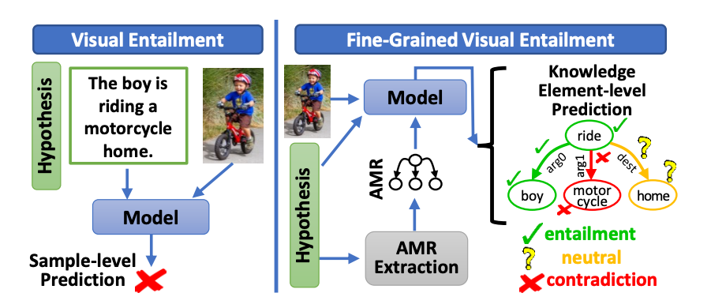

# Fine-Grained Visual Entailment
This is the *PyTorch Implementation* for our paper [Fine-Grained Visual Entailment](https://arxiv.org/abs/2203.15704).


## Abstract
Visual entailment is a recently proposed multimodal reasoning task where the goal is to predict the logical relationship of a piece of text to an image. In this paper, we propose an extension of this task, where the goal is to predict the logical relationship of fine-grained knowledge elements within a piece of text to an image. Unlike prior work, our method is inherently explainable and makes logical predictions at different levels of granularity. Because we lack fine-grained labels to train our method, we propose a novel multi-instance learning approach which learns a fine-grained labeling using only sample-level supervision. We also impose novel semantic structural constraints which ensure that fine-grained predictions are internally semantically consistent.

## Install
Check out [INSTALL.md](docs/INSTALL.md) for installation instructions.

## Download
We provide our dataset, pre-extracted image features for Flickr30K, and model checkpoints. Please see [DOWNLOAD.md](docs/DOWNLOAD.md) for details.

## Training and Evaluation
To replicate our results, please see [RUN.md](docs/RUN.md) for details.

If you want to use custom data, check out [DATA.md](docs/DATA.md) for details on data formats.

## Acknowledgment
Our code builds upon [microsoft/Oscar](https://github.com/microsoft/Oscar).

## Citation

```bibtex
@article{thomas2022fine,
  title={Fine-Grained Visual Entailment},
  author={Thomas, Christopher and Zhang, Yipeng and Chang, Shih-Fu},
  journal={ECCV 2022},
  year={2022}
}
```